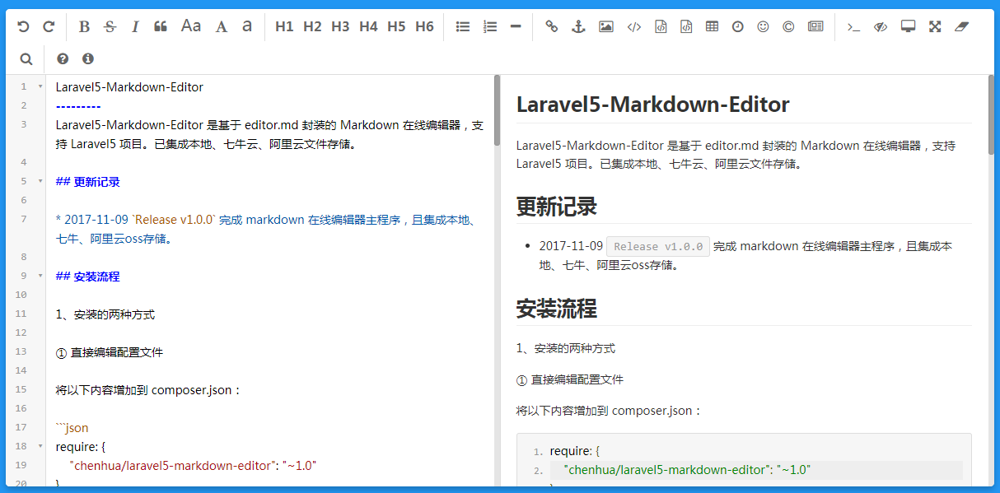

Laravel5-Markdown-Editor
---------
Laravel5-Markdown-Editor 是基于 editor.md 封装的 Markdown 在线编辑器，支持 Laravel5 项目。已集成本地、七牛云、阿里云文件存储。

## 更新记录

* 2017-11-09 `Release v1.0.0` 完成 markdown 在线编辑器主程序，且集成本地、七牛、阿里云oss存储。

## 安装流程

1、安装的两种方式

① 直接编辑配置文件

将以下内容增加到 composer.json：

```json
require: {
    "chenhua/laravel5-markdown-editor": "~1.0"
}
```

然后运行 `composer update`。

② 执行命令安装

运行命令：

```bash
composer require chenhua/laravel5-markdown-editor
```

2、完成上面的操作后，修改 `config/app.php` 中 `providers` 数组

```php
Chenhua\MarkdownEditor\MarkdownEditorServiceProvider::class,
```

3、修改 `config/app.php` 中 `aliases` 数组

```php
'MarkdownEditor' => Chenhua\MarkdownEditor\Facades\MarkdownEditor::class,
```

4、执行 `artisan` 命令，生成 `config/markdowneditor.php` 配置文件

```bash
php artisan vendor:publish --tag=markdown
```

5、修改 `config/markdowneditor.php` 配置文件

```bash
<?php
return [
    "default"     => 'local', //默认返回存储位置url
    "dirver"      => ['local'], //存储平台 ['local', 'qiniu', 'aliyun']
    "connections" => [
        "local"  => [
            'prefix' => 'uploads/markdown', //本地存储位置，默认uploads
        ],
        "qiniu"  => [
            'access_key' => '',
            'secret_key' => '',
            'bucket'     => '',
            'prefix'     => '', //文件前缀 file/of/path
            'domain'     => '' //七牛自定义域名
        ],
        "aliyun" => [
            'ak_id'     => '',
            'ak_secret' => '',
            'end_point'  => '',
            'bucket'    => '',
            'prefix'    => '',
        ],
    ],
];
```
> 七牛和阿里云的配置内容，需要去对应官网申请账号并配置获取，此处省略一万字。。。

## 使用方法

### 在 `xxx.blade.php` 编辑器相应位置添加如下代码：

```html
<div id="test-editormd">
    <textarea name="test-editormd" style="display:none;"></textarea>
</div>

@include('markdown::encode',['editors'=>['test-editormd']])
```
> 以上操作能生成一个 `name="test-editormd"` 的 `markdown` 文本编辑框，并能实时预览效果.

### 解析 `markdown` 格式文本为 `html` 格式

① 前端js方式解析 `markdown` 文本

```html
<div id="doc-content">
    <textarea style="display:none;">
# 这是一个h1标签
## 这是一个h2标签
    </textarea>
</div>
@include('markdown::decode',['editors'=>['doc-content']])
```

② PHP方式解析 `markdown` 文本

```html
    echo MarkdownEditor::parse("#中间填写markdown格式的文本");
```

更多用法可以参考 `editor.md` 官方代码，[解锁更多姿势>>>](http://pandao.github.io/editor.md/)

### 效果展示

default样式：



## License
本扩展遵循 [MIT license](http://opensource.org/licenses/MIT) 开源。


